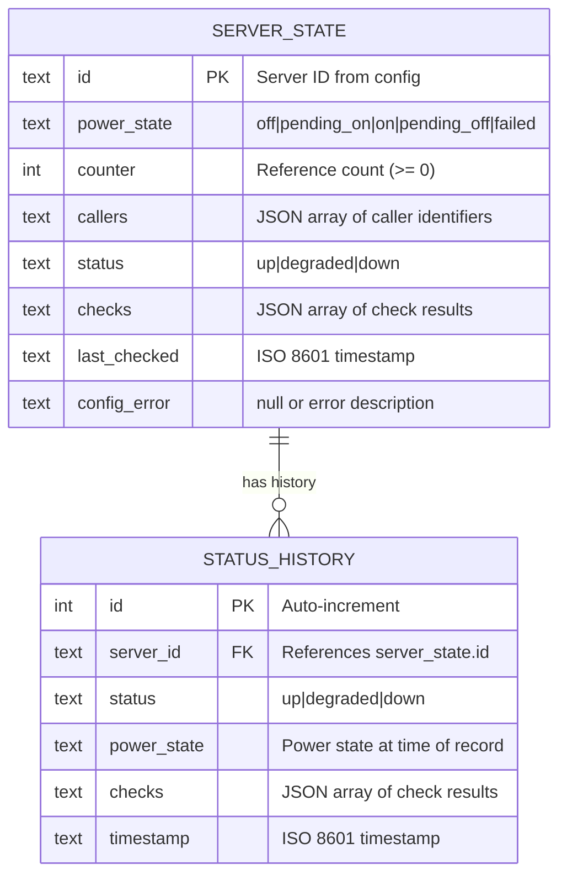
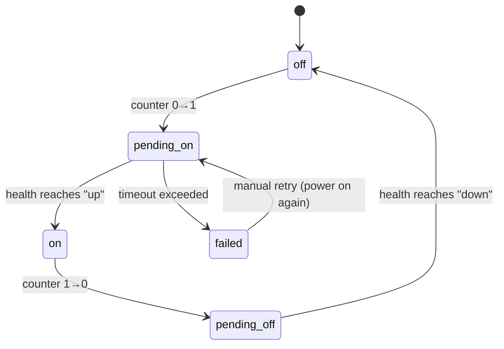

# Data Model

## Overview

servmgr uses SQLite as its persistence layer. The database lives at `/config/servmgr.db` alongside the YAML configuration.

## Entity Relationship



## Tables

### server_state

Primary table tracking the current state of each configured server.

| Column | Type | Description |
|--------|------|-------------|
| id | TEXT PK | Server ID from config.yaml |
| power_state | TEXT | `off`, `pending_on`, `on`, `pending_off`, `failed` |
| counter | INTEGER | Reference counter (0 = server should be off) |
| callers | TEXT | JSON array of strings identifying who requested power on |
| status | TEXT | Health status: `up`, `degraded`, `down` |
| checks | TEXT | JSON array of individual check results |
| last_checked | TEXT | ISO 8601 timestamp of last health check |
| config_error | TEXT | Null if OK, or cycle detection error message |

### status_history

Append-only log of state transitions for the history timeline.

| Column | Type | Description |
|--------|------|-------------|
| id | INTEGER PK | Auto-increment |
| server_id | TEXT FK | References server_state.id |
| status | TEXT | Health status at this point |
| power_state | TEXT | Power state at this point |
| checks | TEXT | JSON check results at this point |
| timestamp | TEXT | ISO 8601 timestamp |

**Index**: `idx_history_server_time` on `(server_id, timestamp)` for efficient range queries.

## State Machine



## JSON Structures

### Check Result (stored in `checks` column)

```json
{
  "type": "ping|http|tcp|ssh|ipmi_power",
  "ok": true,
  "latency_ms": 2,
  "port": 22
}
```

### Callers (stored in `callers` column)

```json
["ha-bedroom-scene", "ha-movie-mode", "dep:homeserver"]
```

Callers prefixed with `dep:` represent dependency relationships (server X needs this server to be on).
